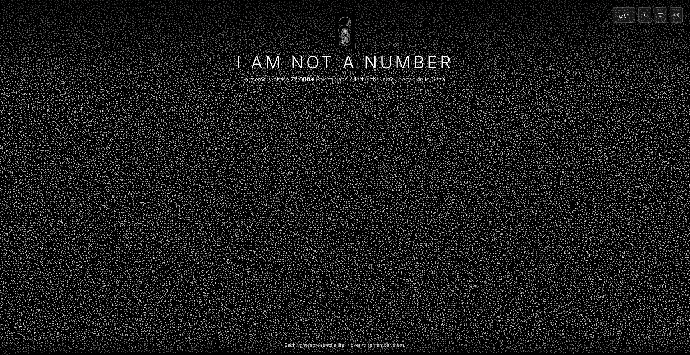

# I Am Not a Number

A visual memorial for the **60,199** Palestinians killed by Israeli forces in Gaza from 7 October 2023 to 31 July 2025. Each floating light on screen represents a life — hover to see their name, age, and date of birth.

The death toll as of February 2026 has since risen to over **73,188+**. Thousands more remain unidentified.

🔗 **Live site:** [https://i-am-not-a-number-palestine.github.io/](https://i-am-not-a-number-palestine.github.io/)



## Features

- **60,199 particles** rendered in real-time using WebGL, each representing a named victim
- **Hover interaction** — particles transform into a male or female silhouette based on the victim's recorded sex, displaying their name, Arabic name, age, and date of birth
- **Bilingual** — full English / Arabic support with RTL layout
- **Age filter** — dual-range slider to filter visible particles by age range
- **Background soundtrack** — ambient audio with mute/unmute toggle
- **Information modal** — context about the data source and methodology

## Data

The source data is a spreadsheet published by the Gaza Ministry of Health, with English name translations by [Iraq Body Count](https://iraqbodycount.org/). The spreadsheet (`moh_2025-07-31.xlsx`) contains the following columns:

| Column | Description |
|--------|-------------|
| `Index` | Row number |
| `Name` | Name in English |
| `الاسم` | Name in Arabic |
| `Age` | Age (years, months, or days) |
| `Born` | Date of birth |
| `Sex` | `m` or `f` |
| `ID` | ID number |

A Python script converts this spreadsheet into a compact JSON file used by the website.

## Prerequisites

- [Node.js](https://nodejs.org/) (v18 or later recommended)
- [Python 3](https://www.python.org/) (only needed to regenerate data from the spreadsheet)
- Python packages: `pandas`, `openpyxl` (only needed for data conversion)

## Getting Started

### 1. Install dependencies

```bash
npm install
```

### 2. Generate data (optional)

The repository already includes a pre-built `public/data.json`. If you need to regenerate it from the spreadsheet (e.g., after updating `moh_2025-07-31.xlsx`):

```bash
pip install pandas openpyxl
npm run data
```

### 3. Run locally

```bash
npm run dev
```

This starts a local development server (typically at `http://localhost:5173/i-am-not-a-number/`).

### 4. Build for production

```bash
npm run build
```

The output is written to the `dist/` directory, ready to be deployed as a static site.

### 5. Preview the production build

```bash
npm run preview
```

## Deploying to GitHub Pages

### Option A: Manual deployment

1. Build the project:

   ```bash
   npm run build
   ```

2. Push the contents of the `dist/` folder to the `gh-pages` branch:

   ```bash
   npx gh-pages -d dist
   ```

   Or manually copy the `dist/` contents to your deployment branch.

3. In your GitHub repository settings, set **Pages → Source** to the `gh-pages` branch.

### Option B: GitHub Actions (automated)

Create `.github/workflows/deploy.yml`:

```yaml
name: Deploy to GitHub Pages

on:
  push:
    branches: [main]

permissions:
  contents: read
  pages: write
  id-token: write

concurrency:
  group: pages
  cancel-in-progress: true

jobs:
  build:
    runs-on: ubuntu-latest
    steps:
      - uses: actions/checkout@v4

      - uses: actions/setup-node@v4
        with:
          node-version: 20
          cache: npm

      - run: npm ci
      - run: npm run build

      - uses: actions/upload-pages-artifact@v3
        with:
          path: dist

  deploy:
    needs: build
    runs-on: ubuntu-latest
    environment:
      name: github-pages
      url: ${{ steps.deployment.outputs.page_url }}
    steps:
      - id: deployment
        uses: actions/deploy-pages@v4
```

After adding this file and pushing to `main`, the site will automatically build and deploy on every push.

> **Note:** The `base` path in `vite.config.js` is set to `/i-am-not-a-number/`. If your repository name differs, update this value accordingly.

## Project Structure

```
├── index.html              # Main HTML page
├── style.css               # All styles
├── vite.config.js          # Vite configuration
├── package.json
├── moh_2025-07-31.xlsx     # Source spreadsheet
├── public/
│   ├── data.json           # Compiled victim data (generated)
│   ├── Handala.png         # Handala illustration (header + favicon)
│   ├── darwish.mp3  # Background soundtrack
│   └── .nojekyll           # Prevents Jekyll processing on GitHub Pages
├── scripts/
│   └── convert-data.py     # Spreadsheet → JSON converter
└── src/
    ├── main.js             # Application entry point, UI logic
    ├── particles.js        # WebGL particle system
    └── i18n.js             # Translations (English & Arabic)
```

## Tech Stack

- **Vite** — build tool and dev server
- **WebGL** — hardware-accelerated rendering of 60,000+ particles
- **Canvas 2D** — overlay layer for hover silhouettes
- **Vanilla JS** — no framework dependencies

## Acknowledgements

- **[Iraq Body Count](https://iraqbodycount.org/)** for translating and publishing the names as a public spreadsheet
- **Gaza Ministry of Health** for documenting the victims under impossible conditions
- Inspired by [Remember Their Names](https://visualizingpalestine.org/gaza-names/en.html) by Visualizing Palestine

## License

This project is open source. The victim data is sourced from publicly available records.
